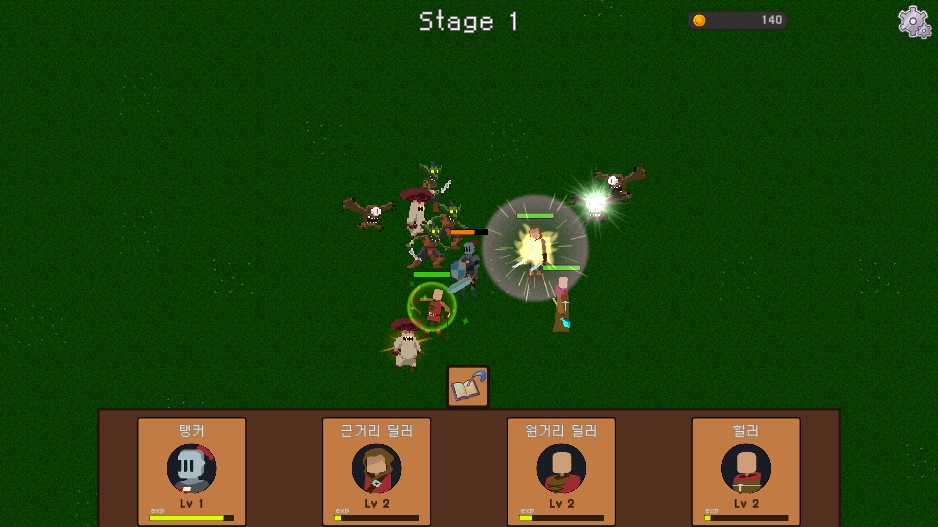

# 🎮 Super Rookie
유니티 포트폴리오: 
- 슈퍼 루키 (2D Idle RPG)

---

# 📣 게임 소개
4가지 직업으로 구성된 플레이어 유닛들이 자동 전투를 진행하며 레벨업 및 스탯 상승을 통해 성장하는 Idle RPG 게임

# 🎥 영상 포트폴리오

- 이미지 클릭

---

# ⏲ 개발기간
- 2024.05.08 ~ 2024.05.15 (7일)

## 👨‍👨‍👧‍👧 멤버구성
- 👨‍💻 프로그래머 : 이진우

## ⚙️ 개발환경
- Unity 2021.3.8f1, C#, Visual Studio 2022 
